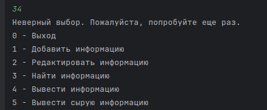
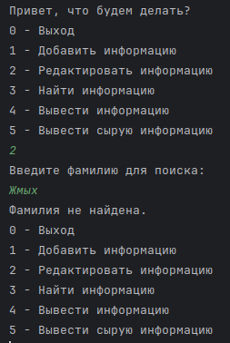
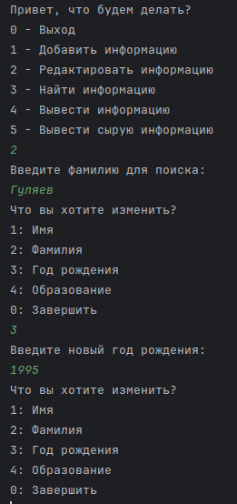

# Инструкция по применению для самых маленьких
- Для начала работы откройте файл с кодом под названием `code.py`, на него указывает стрелка под номером `1`, и нажмите
на кнопку запуска кода, она указана стрелкой номер `2`
*Нажмите на картинку для увеличения*
  - На выбор вам предложат варианты действий, необходимо ввести соответсствующую цифру, от 0 до 5   
    
  `Если вы введёте что-то кроме цифры от 0 до 5 то программа сообщит об этом и попросит повторить ввод`  
  

- При выборе `0` - Программа завершит работу  

- `Так же вы можете завершить работу программы на любом этапе нажав на красный квадрат`  
*Нажмите на картинку для увеличения*

## Добавление структуры
- При выборе `1` - Программа начнёт заполнения новой структуры с данными о человеке. 
1. Первое что попросит вас ввести
программа это - `Имя`
2. Далее программа вас попросит ввести - `Фамилию`
3. После вас попросит ввести `Год рождения` (Желательно вводить в целочисленном формате, например - `1999`)
4. И в конце вас попросят ввести цифру от `1` до `4`, которая соответствует образованию и после ввода вас вернёт в
начальное меню выбора действий  
`Если вы введёте что то кроме цифры от 1 до 5 то программа сообщит что вы ввели неверное число и попросит попробовать ещё раз`  
  
`Если вы где то допустили ошибку, вы можете отредактировать структуру. Смотри раздел - Редактирование структуры`  
  
*Пример правильного ввода*

## Редактирование структуры
- При выборе `2` - Вы можете отредактировать выбранную структуру, поиск нужной структуры происходит по `Фамилии`
1. В начале вас попросят ввести `Фамилию` которая будет находится в структуре которую вы хотите отредактировать  
`Если структуры с данной Фамилией нет или вы ошиблись при вводе Фамилии, то программа сообщит что Фамилия не найдена и 
вернёт вас в основное меню выбора действий`  

2. Далее программа вас попросит ввести цифру соответствующую полю которое необходимо изменить, от `1` до `4`, в конце вы можете
ввести `0` чтобы завершить редактирование  
`При вводе некорректных данных программа сообщит о не верном выборе и попросит вас повторить ввод`  

3. При любом допустимом выборе вас попросят ввести соответствующие данные, при изменении образования инструкции такие же
как и при добавлении структуры (**Смотри** - *Добавление структуры* - пункт 4)  
  
*Пример корректного ввода и изменения информации*

## Поиск информации
- При выборе `3` - Вы можете найти структуру с необходимой вам фамилией
1. Здесь вас попросят ввести фамилию по которой будет производится поиск, после вывода программа выведет информацию 
о человеке, а затем вернёт вас в начальное меню выбора действий   
  
*Пример корректного ввода данных*  
`Если вы ввели Фамилию не правильно или данной Фамилии нет в списоке то прогармма сообщит что Фамилия не найдена и вернёт
вас в основное меню выбора действий`   

## Вывод всей информации
- При выборе `4` - Программа выведет список всех структур которые находятся в файле и вернёт вас в начальное меню выбора действий 
картинка  
  
*Пример работы функции*

## Вывод всей информации в сыром виде
- При выборе `5` - Программа выведет всё что написано в JSON файле без какой либо обработки  
  
*Пример работы функции*
