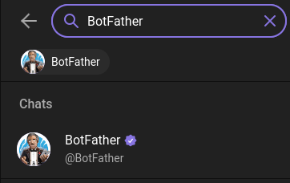
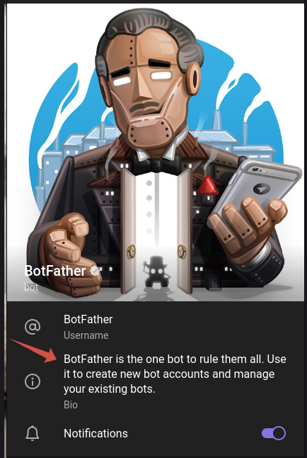
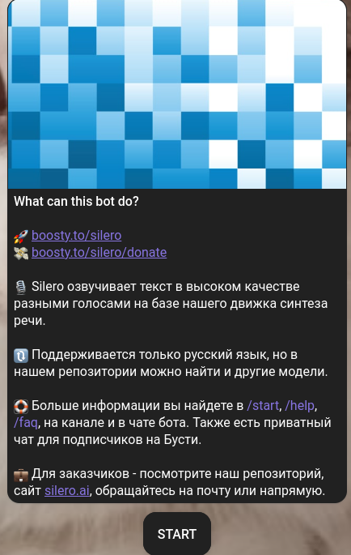

# Документация по созданию Telegram бота
Добро пожаловать в документацию по созданию телеграм бота с использованием платформы BotFather. В этом руководстве мы предоставим вам пошаговую инструкцию по созданию, настройке и запуску вашего собственного бота в мессенджере Telegram с помощью BotFather. Приготовьтесь к тому, чтобы узнать основные шаги и принципы, необходимые для создания бота, который будет эффективно взаимодействовать с вашими пользователями в Telegram.

**Поиск BotFather в Telegram:**

1. Откройте приложение Telegram на своем устройстве.
2. В поисковой строке в верхней части экрана введите "BotFather".
3. Найдите официального аккаунт BotFather в результатах поиска.
4. Нажмите на аккаунт BotFather, чтобы перейти на его страницу.
5. Нажмите кнопку "Start" или введите команду "/start", чтобы начать взаимодействие с BotFather.  
  

- Чтобы создать нового бота нажмите на пункт /newbot или впишите это в чат
- Впишите Имя для бота, его будут видеть все пользователи и нажмите Ввод
- Введите Username для бота. Оно обязательно должно заканчиваться на _bot, например username_bot, это важно!

Отлично, ваш бот создан, теперь чтобы отредактировать вашего бота впишите /mybots или выберите это в меню, оно находится в поле ввода, слева от кнопки смайликов

В списке выберите нужного бота и нажмите на кнопку с его названием

Я опишу несколько пунктов из меню которые понадобятся:
## Api Token
- В этом пункте вы можете узнать API ключ вашего бота

## Edit bot
- В этом пункте вы можете настроить бота, разберём все настройки.  
1) `Edit Name` - Этот пункт отвечает за изменение имени бота, просто введите его новое имя, его видят все пользователи бота
2) `Edit About` - Этот пункт отвечает за изменение описания бота, введите текст который будет указан в описании бота, на примере BotFather он указан стрелкой  
  
3) `Edit Description` - Этот пункт отвечает за изменение приветственного сообщения бота когда пользователь заходит в него первый раз. Пример:  
  
4) `Edit Description Picture` - Этот пункт отвечает за изменение фото которое появляется вместе с приветственным сообщением, на примере выше оно находится над текстом. Есть определенные ограничения на разрешение картинки, о них вам сообщит бот, отправьте боту необходимое вам фото когда выберите этот пункт  
5) `Edit Botpic` - Этот пункт отвечает за изменение аватарки бота, отправьте боту необходимое вам фото когда выберите этот пункт  
6) `Edit Commands` - Этот пункт отвечает за команды бота, по типу `/start`, лучше этот пункт не редактировать, команды задаёт программист в программном коде бота  